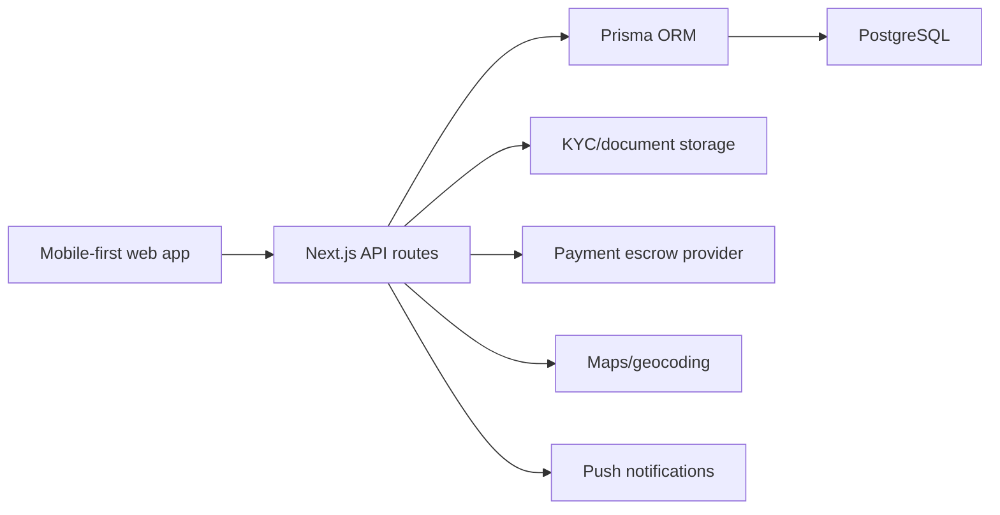

# Flexhands

A modern full-stack starter for a verified local handyman and daily micro-task marketplace. It is shaped like TaskRabbit, with local task discovery, identity and eligibility document checks, blocking/reporting, escrow-style payment states, profile settings, and double-sided reviews.

## Stack

- **Frontend:** Next.js App Router, React, TypeScript, Tailwind CSS, lucide-react icons
- **Backend:** Next.js API routes
- **Database:** PostgreSQL with Prisma ORM
- **Auth:** Email/password with JWT starter helpers
- **Integrations to connect:** document/KYC review provider, maps/geocoding, payment provider, push notification provider

## Architecture



## Domain Model

- **User:** dual-role client/doer/admin profile with contact info, location, rating totals, and student flag.
- **Verification:** identity, work permit, or student enrollment document status.
- **Task:** poster, assigned doer, category, budget, final price, geo coordinates, and lifecycle status.
- **Offer:** doer bid/counter-offer records attached to a task.
- **Message:** task-scoped chat with optional offer references.
- **Payment:** escrow-like payment record with held/released/refunded/disputed states.
- **Review:** double-sided post-completion ratings, positive/negative sentiment, and written review.
- **Report / Block:** moderation and safety controls.
- **Notification:** in-app alert feed for messages, offers, task states, payment, reviews, and security events.

The full schema is in `prisma/schema.prisma`.

## Important Flows

### Signup and Verification

1. User signs up with role, phone, and student status.
2. API creates pending document verification requirements.
3. `/api/verifications` accepts document URLs for national ID/passport and either work permit or student enrollment.
4. Admin/KYC provider updates verification status before unrestricted task activity.

### Task and Offer

1. Client posts a task through `/api/tasks`.
2. Doers browse open tasks by radius using `lat`, `lng`, and `radiusKm`.
3. Doer submits an offer through `/api/offers`.
4. Client accepts an offer through `/api/offers/[id]/accept`.
5. The accepted offer creates a payment record ready to fund.

### Escrow

1. Client funds escrow through `/api/payments/[id]/hold`.
2. Task moves to `IN_PROGRESS`.
3. Doer completes the task and client approves completion.
4. Client releases funds through `/api/payments/[id]/release`, moving payment to `RELEASED` and task to `PAID`.

In production, replace the demo provider references with Stripe Connect, Mangopay, Adyen for Platforms, or another provider that legally supports marketplace held funds in your operating region.

## API Route Map

- `POST /api/auth/signup`
- `POST /api/auth/login`
- `POST /api/auth/password-reset`
- `POST /api/verifications`
- `GET /api/tasks?lat=52.52&lng=13.405&radiusKm=10`
- `POST /api/tasks`
- `POST /api/offers`
- `POST /api/offers/[id]/accept`
- `POST /api/messages`
- `POST /api/payments/[id]/hold`
- `POST /api/payments/[id]/release`
- `POST /api/reviews`
- `POST /api/safety/report`
- `POST /api/safety/block`
- `GET /api/notifications`

Authenticated routes expect:

```http
Authorization: Bearer <jwt>
```

## Local Setup

```bash
npm install
cp .env.example .env
npm run prisma:generate
npm run prisma:migrate
npm run dev
```

Then open `http://localhost:3000`.

## Production Notes

- Store verification documents in private object storage, never as public URLs.
- Add malware scanning and signed upload URLs for document intake.
- Use real-time transport for chat and notifications: WebSockets, Pusher, Ably, Supabase Realtime, or Socket.IO.
- Add push subscriptions for web push and mobile PWA notifications.
- Add moderation queues for reports and verification review.
- Use provider webhooks to make payment status authoritative.
- Add rate limiting to login, messaging, reports, and offer endpoints.
- Use geospatial indexes such as PostGIS for large-scale radius queries.
- Add audit logs for identity, payment, moderation, and admin actions.
